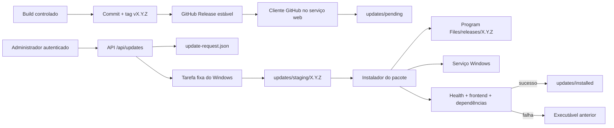
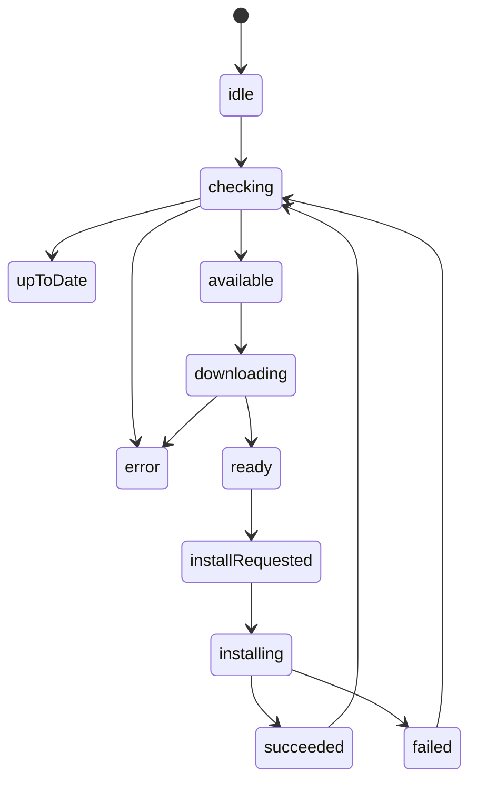

# Handoff para replicar o atualizador automático

## 1. Finalidade deste documento

Este é o documento de implementação para o agente que vai reproduzir, em outra
aplicação Windows, o mesmo fluxo de atualização automática usado pelo
**CPNTeck Paper Machine Historian**.

A referência congelada deste documento é:

| Item | Referência |
| --- | --- |
| Versão funcional | `0.1.6` |
| Tag | `v0.1.6` |
| Commit da aplicação e do pacote | `3f6b8398b963a26a6b143dfecefb26d0534261ef` |
| Repositório | `FabioTCampion/ADF_MP1_TC4024_67` |
| Branch publicada | `codex/paper-machine-historian-mvp` |
| SHA-256 do pacote de referência | `4E5939E14C6F4729CF65773BD9F4E6D908ADC90CA02FAACEB562E25D7730D467` |

O documento [UPDATE-SYSTEM.md](UPDATE-SYSTEM.md) continua sendo a referência de
arquitetura, operação e segurança. Este handoff é mais prescritivo: informa
quais componentes implementar, em que ordem, quais contratos preservar e como
provar que a cópia se comporta como o sistema atual.

### 1.1 Regra para o agente executor

Não copiar apenas a tela ou os endpoints. O fluxo só está completo quando todos
os seguintes elementos existem e trabalham juntos:

1. geração de pacote autocontido;
2. manifesto interno;
3. checksum externo;
4. GitHub Release estável;
5. cliente de Releases privadas;
6. estado persistido do atualizador;
7. download para área controlada;
8. confirmação administrativa;
9. tarefa agendada externa executada como `SYSTEM`;
10. instalador com release side-by-side;
11. backup, validação de prontidão e rollback;
12. logs e diagnóstico.

Não habilitar a instalação pela webpage enquanto a tarefa externa, as ACLs, o
rollback e os testes de integração não estiverem prontos.

## 2. Resultado esperado

O servidor de produção:

- não possui uma cópia de trabalho do Git;
- não executa `git pull`;
- não compila código;
- consulta somente a última GitHub Release estável;
- usa um token de produção com acesso somente leitura a um repositório;
- baixa o pacote em segundo plano;
- valida o pacote antes de oferecê-lo;
- instala somente após confirmação de um Administrador;
- executa a troca de versão fora do processo web;
- preserva dados e configuração;
- restaura o executável anterior se a nova aplicação não ficar pronta.

O fluxo não reinicia o Windows, TwinCAT ou PLC. Somente o serviço da aplicação
é interrompido durante a troca.

## 3. Arquitetura obrigatória



### 3.1 Fronteiras de privilégio

| Processo | Pode fazer | Não deve fazer |
| --- | --- | --- |
| Usuário de consulta | Visualizar páginas comuns | Ver ou acionar atualizações |
| Administrador da aplicação | Consultar, baixar e solicitar instalação | Informar caminho ou comando arbitrário |
| Serviço web | Ler GitHub, baixar, validar e gravar solicitação | Trocar seu próprio executável |
| Tarefa agendada `SYSTEM` | Validar solicitação e executar instalador fixo | Aceitar parâmetros vindos diretamente da webpage |
| Instalador `SYSTEM` | Parar/iniciar serviço, copiar release e fazer rollback | Reiniciar PLC ou Windows |
| Token do servidor | Ler conteúdo e Releases do repositório selecionado | Publicar código ou Release |

## 4. Matriz de identidade do novo produto

Antes de implementar, preencher esta tabela. Um valor não pode ser alterado em
somente um arquivo; todos os consumidores listados na seção 5 devem usar a
mesma identidade.

| Chave lógica | Valor atual | Valor da nova aplicação |
| --- | --- | --- |
| `ProductDisplayName` | `CPNTeck Paper Machine Historian` | preencher |
| `PackageNamePrefix` | `CPNTeck-PaperMachineHistorian` | preencher |
| `ExecutableName` | `PaperMachine.Historian.Web.exe` | preencher |
| `ServiceName` | `CPNTeckPaperMachineHistorian` | preencher |
| `ServiceDisplayName` | `CPNTeck Paper Machine Historian` | preencher |
| `UpdaterTaskName` | `CPNTeckPaperMachineHistorianUpdater` | preencher |
| `InstallRoot` | `C:\Program Files\CPNTeck\PaperMachineHistorian` | preencher |
| `DataRoot` | `C:\ProgramData\CPNTeck\PaperMachineHistorian` | preencher |
| `DatabaseFileName` | `PaperMachineHistorian.db` | preencher |
| `ConfigurationEnvironmentVariable` | `PAPER_MACHINE_HISTORIAN_CONFIG` | preencher |
| `TokenEnvironmentVariable` | `PAPER_MACHINE_HISTORIAN_GITHUB_TOKEN` | preencher |
| `RepositoryOwner` | `FabioTCampion` | preencher |
| `RepositoryName` | `ADF_MP1_TC4024_67` | preencher |
| `RuntimeIdentifier` | `win-x64` | preencher |
| `HttpPort` | `5088` | preencher |
| `HealthPath` | `/health` | preencher |
| `ReadinessPath` | `/health/ready` | preencher |
| `AdministratorRole` | `Administrator` | preencher |

### 4.1 Regra de nome do pacote

O contrato entre publicador e servidor é:

```text
<PackageNamePrefix>-<X.Y.Z>-<RuntimeIdentifier>.zip
<PackageNamePrefix>-<X.Y.Z>-<RuntimeIdentifier>.zip.sha256
```

No sistema atual:

```text
CPNTeck-PaperMachineHistorian-0.1.6-win-x64.zip
CPNTeck-PaperMachineHistorian-0.1.6-win-x64.zip.sha256
```

Não usar o arquivo **Source code (zip)** criado automaticamente pelo GitHub.
Ele não contém a publicação autocontida nem o contrato de implantação.

## 5. Fontes atuais e responsabilidade de cada arquivo

O agente deve ler estes arquivos antes de portar o fluxo:

| Arquivo | Responsabilidade |
| --- | --- |
| `scripts/Publish-PaperMachineHistorian.ps1` | Cache validado, lint, testes isolados, `dotnet publish`, ZIP rápido, manifesto e SHA-256 |
| `scripts/Release-PaperMachineHistorian.ps1` | Versão automática, preflight, tag, push, draft, upload, publicação e verificação da Release |
| `RELEASE-PROCESS.md` | Operação e diagnóstico do fluxo de build/Release otimizado |
| `deploy/appsettings.Production.json` | Valores padrão da seção `Updates` |
| `UpdateOptions.cs` | Binding, defaults, resolução de caminhos e validação |
| `UpdateModels.cs` | DTO público, modelo da Release e estado persistido |
| `GitHubReleaseClient.cs` | API GitHub privada e streaming dos assets |
| `UpdatePackageValidator.cs` | Parser SHA-256, hash e leitura do manifesto no ZIP |
| `ApplicationUpdateService.cs` | Máquina de estados, download, validação e solicitação |
| `UpdateCheckWorker.cs` | Verificação automática periódica |
| `UpdateEndpoints.cs` | API administrativa com rate limiting |
| `UpdatesScreen.tsx` | Operação, polling, progresso e confirmação |
| `Install-PaperMachineHistorianUpdater.ps1` | Estrutura de atualização e tarefa `SYSTEM` |
| `Invoke-PaperMachineHistorianPendingUpdate.ps1` | Executor externo, lock, staging e arquivamento |
| `Install-PaperMachineHistorianService.ps1` | Instalação side-by-side, serviço, backup, prontidão e rollback automático |
| `Update-PaperMachineHistorianService.ps1` | Entrada segura para atualizar uma instalação existente |
| `Rollback-PaperMachineHistorianService.ps1` | Rollback manual |
| `Set-PaperMachineHistorianUpdateToken.ps1` | Captura mascarada e ACL do token |
| `Test-PaperMachineHistorianInstallation.ps1` | Validação operacional da instalação |
| `ApplicationUpdateTests.cs` | Testes unitários mínimos do contrato |

### 5.1 Não manter literais antigos no novo produto

Depois da adaptação, pesquisar obrigatoriamente:

```powershell
rg -n `
  "PaperMachine|Paper Machine|PAPER_MACHINE_HISTORIAN|5088|ADF_MP1_TC4024_67" `
  <raiz-da-nova-aplicacao>
```

Cada ocorrência deve ser classificada como:

- substituída pela identidade nova;
- intencional e documentada;
- removida.

Especial atenção aos scripts PowerShell: atualmente alguns defaults e a linha
que grava `UpdaterTaskName` são específicos do Historian. Uma cópia parcial
pode instalar a tarefa certa, mas fazer a aplicação tentar acionar a tarefa
antiga.

## 6. Configuração

Seção atual:

```json
{
  "Updates": {
    "Enabled": true,
    "Provider": "GitHub",
    "RepositoryOwner": "FabioTCampion",
    "RepositoryName": "ADF_MP1_TC4024_67",
    "ApiBaseUrl": "https://api.github.com",
    "RuntimeIdentifier": "win-x64",
    "PackageNamePrefix": "CPNTeck-PaperMachineHistorian",
    "CheckIntervalMinutes": 30,
    "AutoDownload": true,
    "WorkingDirectory": "",
    "TokenFilePath": "",
    "UpdaterTaskName": "CPNTeckPaperMachineHistorianUpdater"
  }
}
```

### 6.1 Semântica exata

| Campo | Regra |
| --- | --- |
| `Enabled` | Desabilita worker e ações quando `false` |
| `Provider` | Deve ser `GitHub`, sem diferenciar maiúsculas |
| `RepositoryOwner` | Obrigatório |
| `RepositoryName` | Obrigatório |
| `ApiBaseUrl` | URI absoluta obrigatoriamente HTTPS |
| `RuntimeIdentifier` | Parte do nome exato do asset |
| `PackageNamePrefix` | Parte do nome exato do asset |
| `CheckIntervalMinutes` | Entre 5 e 1440 |
| `AutoDownload` | Se `true`, a verificação também baixa a versão encontrada |
| `WorkingDirectory` | Vazio significa `<DataRoot>\updates` |
| `TokenFilePath` | Vazio significa `<WorkingDirectory>\github-token.txt` |
| `UpdaterTaskName` | Nome fixo acionado por `schtasks.exe` |

No sistema atual, `DataRoot` é deduzido a partir do diretório pai da pasta que
contém o banco. Na aplicação nova, é preferível representar `DataRoot`
explicitamente e derivar banco, chaves, backups e atualizações a partir dele.

### 6.2 Token

Ordem de resolução atual:

1. variável de ambiente `PAPER_MACHINE_HISTORIAN_GITHUB_TOKEN`;
2. arquivo definido em `Updates:TokenFilePath`.

O token não pode ficar no JSON, no Git, nos argumentos do processo ou nos logs.
O script de configuração:

1. exige PowerShell elevado;
2. usa `Read-Host -AsSecureString`;
3. grava ASCII sem newline;
4. remove herança da ACL;
5. concede controle somente a `SYSTEM` (`S-1-5-18`) e Administradores locais
   (`S-1-5-32-544`);
6. limpa a memória não gerenciada usada na conversão do `SecureString`.

Para repositório privado, usar fine-grained PAT:

- acesso somente ao repositório de atualização;
- `Repository permissions > Contents > Read-only`;
- expiração definida;
- sem `Administration`, `Actions`, `Workflows` ou escrita.

## 7. Layout persistente do servidor

```text
C:\Program Files\CPNTeck\PaperMachineHistorian\
└── releases\
    ├── 0.1.5\
    │   └── PaperMachine.Historian.Web.exe
    └── 0.1.6\
        └── PaperMachine.Historian.Web.exe

C:\ProgramData\CPNTeck\PaperMachineHistorian\
├── appsettings.Production.json
├── deployment-state.json
├── data\
│   ├── PaperMachineHistorian.db
│   ├── PaperMachineHistorian.db-wal
│   └── PaperMachineHistorian.db-shm
├── keys\
├── backups\
│   └── before-<versao>-<yyyyMMdd-HHmmss>\
└── updates\
    ├── github-token.txt
    ├── update-status.json
    ├── update-request.json
    ├── update.lock
    ├── pending\
    ├── staging\
    ├── installed\
    ├── failed\
    ├── logs\
    └── updater\
        └── Invoke-PaperMachineHistorianPendingUpdate.ps1
```

### 7.1 Separação que não pode ser perdida

- binários imutáveis por versão: `Program Files`;
- dados/configuração/segredos/estado: `ProgramData`;
- o serviço aponta diretamente para o executável da versão corrente;
- atualizar significa instalar uma nova pasta e alterar o `binPath` do serviço;
- banco, chaves e configuração nunca ficam dentro da pasta da release;
- o executor estável da tarefa fica em `ProgramData\...\updates\updater`, pois
  não pode depender da release que será substituída.

## 8. Contrato do pacote

O ZIP atual possui exatamente uma pasta no primeiro nível:

```text
<PackageNamePrefix>-<X.Y.Z>-<RuntimeIdentifier>\
├── app\
│   ├── <ExecutableName>
│   └── demais arquivos publicados
├── config\
│   └── appsettings.Production.json
├── deployment-manifest.json
├── DEPLOYMENT.md
├── Install-...Service.ps1
├── Update-...Service.ps1
├── Rollback-...Service.ps1
├── Test-...Installation.ps1
├── Install-...Updater.ps1
├── Invoke-...PendingUpdate.ps1
└── Set-...UpdateToken.ps1
```

O pacote `0.1.6` de referência contém 423 entradas: um manifesto e 422 arquivos
declarados no manifesto.

### 8.1 Manifesto interno

Formato:

```json
{
  "Product": "CPNTeck Paper Machine Historian",
  "Version": "0.1.6",
  "RuntimeIdentifier": "win-x64",
  "CreatedAtUtc": "2026-07-26T00:00:00.0000000Z",
  "GitCommit": "3f6b839",
  "GitDirty": false,
  "Files": [
    {
      "Path": "app/PaperMachine.Historian.Web.exe",
      "Length": 123,
      "Sha256": "<64 caracteres hexadecimais>"
    }
  ]
}
```

Sequência de geração:

1. testar solução;
2. executar `dotnet publish -c Release -r win-x64 --self-contained true`;
3. copiar configuração, scripts e documentação;
4. calcular hash de todos os arquivos que já estão no pacote;
5. gerar `deployment-manifest.json`;
6. compactar a pasta raiz completa;
7. calcular SHA-256 do ZIP;
8. gerar o sidecar:

```text
<SHA256_EM_MAIUSCULAS><dois espaços><nome-do-zip>
```

O manifesto não lista a si próprio, pois é criado depois da enumeração. O
instalador atual confere existência e SHA-256 de cada item listado. Ele não
rejeita arquivos extras e não usa o campo `Length` como validação. Se o novo
produto precisar endurecer o contrato, implementar essas duas verificações
sem remover as anteriores.

### 8.2 Rastreabilidade obrigatória

Para uma Release oficial:

```text
Version = versão da tag sem "v"
GitCommit = commit apontado pela tag
GitDirty = false
```

Não publicar um pacote com `GitDirty: true`. Não gerar o pacote de um commit e
mover a tag para outro.

## 9. Protocolo de publicação

Executar na estação de build, nunca no servidor industrial.

Na implementação de referência, todo o protocolo das seções 9.1 a 9.6 é
orquestrado por:

```powershell
.\scripts\Release-PaperMachineHistorian.ps1 -Version X.Y.Z
```

Se a versão for omitida, o patch da última Release estável é incrementado. O
script pode retomar uma tag/draft somente quando eles apontam para o mesmo
commit. Uma Release estável existente nunca é sobrescrita. As etapas manuais
abaixo continuam sendo o contrato detalhado e o procedimento de contingência.

### 9.1 Pré-condições

```powershell
git status --short -- <pasta-da-aplicacao>
git rev-parse HEAD
git tag --list "v$version"
```

Condições:

- não há alterações da aplicação fora do commit;
- branch contém todo o código esperado;
- a versão ainda não possui tag nem Release;
- testes estão aprovados;
- `HEAD` foi anotado para comparação posterior.

### 9.2 Enviar a branch

```powershell
git push origin <branch>
```

Confirmar no remoto:

```powershell
git ls-remote origin "refs/heads/<branch>"
```

O hash remoto deve ser o mesmo de `git rev-parse HEAD`.

### 9.3 Gerar e validar artefatos

Na raiz da aplicação:

```powershell
.\scripts\Publish-<Produto>.ps1 -Version X.Y.Z
```

Não usar `-SkipTests` em publicação oficial.

Validar:

```powershell
$package = ".\artifacts\<Prefixo>-X.Y.Z-win-x64.zip"
$checksum = "$package.sha256"
$actual = (Get-FileHash -LiteralPath $package -Algorithm SHA256).Hash
$expected = ((Get-Content -LiteralPath $checksum -Raw).Trim() -split '\s+')[0]
if ($actual -ne $expected.ToUpperInvariant()) {
    throw 'Checksum local divergente.'
}
```

Abrir o manifesto dentro do ZIP e confirmar `Version`, `GitCommit`,
`GitDirty = false`, runtime e nome do produto.

### 9.4 Criar a tag imutável

```powershell
git tag -a vX.Y.Z <hash-completo-do-HEAD> -m "<Produto> X.Y.Z"
git push origin vX.Y.Z
```

Validar a tag anotada:

```powershell
git ls-remote origin "refs/tags/vX.Y.Z" "refs/tags/vX.Y.Z^{}"
```

`refs/tags/vX.Y.Z^{}` deve apontar para o mesmo commit do pacote. Nunca apagar,
mover ou reutilizar uma tag publicada.

### 9.5 Criar a Release

Fluxo recomendado, mantendo a Release invisível até todos os assets estarem
presentes:

```powershell
$repository = '<owner>/<repository>'
$version = 'X.Y.Z'
$package = ".\artifacts\<Prefixo>-$version-win-x64.zip"
$checksum = "$package.sha256"

gh release create "v$version" `
  --repo $repository `
  --verify-tag `
  --draft `
  --title "<Produto> $version" `
  --notes "<notas da versão>" `
  $package $checksum

gh release edit "v$version" `
  --repo $repository `
  --draft=false `
  --latest
```

Regras:

- stable/latest;
- `draft = false`;
- `prerelease = false`;
- tag existente e verificada;
- ZIP e `.sha256` anexados com nomes exatos;
- não substituir assets depois da publicação;
- habilitar immutable releases no GitHub quando disponível.

### 9.6 Verificação pós-publicação

```powershell
gh release view "v$version" `
  --repo $repository `
  --json tagName,name,isDraft,isPrerelease,url,assets,publishedAt

gh api "repos/$repository/releases/latest" --jq .tag_name
```

Conferir nos assets:

- `state = uploaded`;
- nome exato;
- tamanho local igual ao remoto;
- digest remoto do ZIP igual ao SHA-256 local;
- `latest` retorna a nova tag.

Somente depois dessa conferência informar que a Release foi concluída.

## 10. Bootstrap do servidor

O primeiro salto de uma versão sem atualizador para uma versão com atualizador
é manual. O fluxo web não consegue instalar sua própria infraestrutura antes
que a tarefa agendada exista.

### 10.1 Primeira instalação

1. copiar o ZIP oficial para uma pasta temporária;
2. conferir o SHA-256;
3. extrair;
4. abrir PowerShell como Administrador dentro da pasta extraída;
5. executar o instalador com os parâmetros específicos da aplicação;
6. validar serviço, tarefa e endpoints;
7. configurar o token de leitura.

Referência atual:

```powershell
powershell.exe -ExecutionPolicy Bypass -File `
  .\Install-PaperMachineHistorianService.ps1 `
  -AmsNetId '192.168.100.1.1.1' `
  -RemoteIp '10.8.0.4'

powershell.exe -ExecutionPolicy Bypass -File `
  .\Set-PaperMachineHistorianUpdateToken.ps1

.\Test-PaperMachineHistorianInstallation.ps1
```

`AmsNetId` e `RemoteIp` são requisitos do Historian, não requisitos genéricos
do atualizador. A nova aplicação deve substituí-los por suas próprias
dependências obrigatórias.

### 10.2 Bootstrap ao atualizar uma instalação antiga

Se o serviço já existe, usar uma vez:

```powershell
powershell.exe -ExecutionPolicy Bypass -File `
  .\Update-PaperMachineHistorianService.ps1
```

Esse wrapper:

1. verifica se o serviço já existe;
2. localiza o instalador no mesmo pacote;
3. encaminha somente parâmetros conhecidos;
4. chama o mesmo instalador da primeira instalação.

Depois desse salto, a tarefa e o executor estável passam a existir.

## 11. Descoberta automática

### 11.1 Worker

Com `Updates:Enabled = true`:

1. a aplicação aguarda um minuto depois de iniciar;
2. executa uma verificação;
3. cria `PeriodicTimer` com `CheckIntervalMinutes`;
4. repete enquanto o serviço estiver ativo;
5. registra falhas sem interromper a coleta principal.

Com `AutoDownload = true`, cada verificação baixa e valida automaticamente uma
versão nova. Com `false`, permanece em `available` até o Administrador solicitar
o download.

### 11.2 Chamada ao GitHub

```text
GET https://api.github.com/repos/<owner>/<repo>/releases/latest
Authorization: Bearer <token>
Accept: application/vnd.github+json
User-Agent: <identidade-do-atualizador>/1.0
```

O `HttpClient` atual:

- timeout de cinco minutos;
- usa `ResponseHeadersRead` para metadata e pacote;
- baixa o ZIP em blocos de 128 KiB;
- não carrega o ZIP inteiro na memória;
- usa a URL de API do asset com
  `Accept: application/octet-stream`.

O endpoint `/releases/latest` não retorna drafts nem pre-releases. Uma tag sem
Release publicada também não é descoberta.

### 11.3 Comparação de versão

Algoritmo atual:

1. `Trim`;
2. remove um `v` ou `V` inicial;
3. remove tudo a partir do primeiro `-` ou `+`;
4. usa `System.Version.TryParse`;
5. aceita somente `candidate > current`.

Exemplos:

| Candidata | Instalada | Resultado |
| --- | --- | --- |
| `v0.1.6` | `0.1.5` | nova |
| `0.1.6` | `0.1.6` | não instala |
| `0.1.5` | `0.1.6` | não instala |
| `0.2.0-beta` | `0.1.9` | normaliza para `0.2.0` |

Embora o normalizador aceite sufixos, o canal oficial deve publicar somente
Releases estáveis com versão `X.Y.Z`.

## 12. Download e preparação

Para a versão descoberta `X.Y.Z`, a aplicação:

1. monta o nome exato do ZIP;
2. exige exatamente um asset com esse nome;
3. procura `<zip>.sha256`;
4. se o sidecar estiver ausente, aceita o campo GitHub
   `digest = sha256:<hash>`;
5. no fluxo oficial, exige-se o sidecar mesmo com o fallback disponível;
6. limita o conteúdo textual do sidecar a 4096 caracteres;
7. aceita o primeiro token com exatamente 64 caracteres hexadecimais;
8. grava em `pending\<nome>.partial`;
9. calcula SHA-256 do `.partial`;
10. abre o ZIP e exige exatamente um `deployment-manifest.json`;
11. compara a versão do manifesto com a tag normalizada;
12. move atomicamente `.partial` para o nome final;
13. persiste estado `ready`.

Se falhar:

- o `.partial` é removido;
- o estado passa a `error`;
- `lastError` recebe a mensagem;
- a aplicação principal continua executando.

## 13. API e interface web

Todos os endpoints usam:

```text
/api/updates
```

Proteções atuais:

- autenticação por cookie;
- role `Administrator`;
- rate limiter `updates`;
- 10 requisições por minuto;
- fila zero.

### 13.1 Contratos

#### `GET /api/updates/status`

Retorna o estado atual. Não aciona o GitHub.

#### `POST /api/updates/check`

Consulta a última Release. Se `AutoDownload = true`, também baixa e valida.

#### `POST /api/updates/download`

Baixa a Release já encontrada. Se a memória não possuir a Release, consulta
novamente antes de baixar.

#### `POST /api/updates/install`

Corpo:

```json
{
  "version": "0.1.6"
}
```

Resposta de sucesso: HTTP `202 Accepted`, com localização
`/api/updates/status`.

O backend registra como solicitante
`principal.Identity.Name`, usando `administrator` como fallback.

### 13.2 Tela

A tela atual:

- aparece somente para usuário com permissão `updates.view`;
- consulta o status ao abrir;
- repete a consulta a cada três segundos;
- oferece `Verificar agora`;
- oferece download quando o estado é `available`;
- mostra percentual, tamanho, Release notes e SHA-256;
- exige que o Administrador digite exatamente a versão disponível;
- avisa que haverá alguns segundos sem coleta;
- não permite informar caminho, URL, tarefa ou comando.

A autorização do backend é obrigatória mesmo que o menu esteja oculto.

## 14. Estado persistido

Arquivo:

```text
<DataRoot>\updates\update-status.json
```

Estrutura lógica:

```json
{
  "state": "ready",
  "lastCheckedAtUtc": "2026-07-26T00:00:00Z",
  "availableVersion": "0.1.6",
  "releaseName": "CPNTeck Paper Machine Historian 0.1.6",
  "releaseNotes": "Notas da versão",
  "publishedAtUtc": "2026-07-26T00:00:00Z",
  "packageFileName": "CPNTeck-PaperMachineHistorian-0.1.6-win-x64.zip",
  "packagePath": "C:\\ProgramData\\...\\updates\\pending\\...zip",
  "packageSizeBytes": 53434505,
  "downloadedBytes": 53434505,
  "packageSha256": "4E5939E14C6F4729CF65773BD9F4E6D908ADC90CA02FAACEB562E25D7730D467",
  "downloadedAtUtc": "2026-07-26T00:00:00Z",
  "installRequestedAtUtc": null,
  "installedAtUtc": null,
  "lastError": null
}
```

O serviço grava o JSON em um arquivo temporário com GUID e usa
`File.Move(..., overwrite: true)`. Preservar essa escrita atômica.

### 14.1 Estados



Quando `Enabled = false`, o DTO público apresenta `disabled` sem necessariamente
reescrever o arquivo persistido.

## 15. Confirmação da instalação

Antes de criar a solicitação, o serviço:

1. exige estado `ready`;
2. exige caminho, SHA-256 e versão disponíveis;
3. compara a versão digitada com a preparada;
4. confirma que o ZIP ainda existe;
5. recalcula SHA-256;
6. grava solicitação de forma atômica;
7. muda o estado para `installRequested`;
8. aciona uma tarefa conhecida por nome.

Contrato de `update-request.json`:

```json
{
  "version": "0.1.6",
  "packagePath": "C:\\ProgramData\\CPNTeck\\PaperMachineHistorian\\updates\\pending\\CPNTeck-PaperMachineHistorian-0.1.6-win-x64.zip",
  "sha256": "4E5939E14C6F4729CF65773BD9F4E6D908ADC90CA02FAACEB562E25D7730D467",
  "requestedAtUtc": "2026-07-26T00:00:00Z",
  "requestedBy": "admin"
}
```

Acionamento:

```text
%SystemRoot%\System32\schtasks.exe /Run /TN <UpdaterTaskName>
```

Usar `ProcessStartInfo.ArgumentList`; não concatenar a versão ou um caminho
fornecido pela webpage em uma linha de comando.

## 16. Tarefa externa

O instalador da tarefa cria:

- usuário: `SYSTEM`;
- logon: `ServiceAccount`;
- nível: `Highest`;
- limite de execução: 20 minutos;
- concorrência: `IgnoreNew`;
- `StartWhenAvailable`;
- executável: Windows PowerShell;
- `-NoProfile`;
- `-ExecutionPolicy Bypass`;
- script fixo em `updates\updater`;
- argumentos fixos de `DataRoot`, `InstallRoot`, `ServiceName` e `HttpPort`.

A tarefa não recebe a versão nem o pacote como argumentos. Ela lê a solicitação
em uma pasta protegida. Essa separação é uma condição de segurança.

## 17. Executor da atualização

Sequência exata de `Invoke-...PendingUpdate.ps1`:

1. cria as pastas operacionais;
2. inicia transcript em
   `logs\update-<yyyyMMdd-HHmmss>.log`;
3. adquire `update.lock` com `FileShare.None`;
4. exige `update-request.json`;
5. exige versão com regex `^\d+\.\d+\.\d+$`;
6. resolve o caminho canônico do pacote;
7. exige que ele comece por `<updates>\pending\`;
8. exige que o arquivo exista;
9. recalcula SHA-256 e compara com a solicitação;
10. grava estado `installing`;
11. calcula `staging\<versão>` e valida o prefixo canônico;
12. remove staging antigo somente depois dessa validação;
13. extrai o ZIP;
14. procura recursivamente exatamente um script `Update-...Service.ps1`;
15. chama o script com parâmetros fixos;
16. em sucesso, move o ZIP para `installed`;
17. remove `update-request.json`;
18. grava estado `succeeded`;
19. sempre remove staging, solta lock e encerra transcript.

Em falha:

- grava `failed` e a mensagem;
- copia o ZIP para `failed`;
- tenta iniciar o serviço se ele ficou parado;
- mantém evidência no log;
- relança a exceção para o histórico da tarefa.

## 18. Instalador side-by-side

O instalador principal deve ser idempotente onde possível e exigir elevação.

### 18.1 Validações antes da troca

1. `deployment-manifest.json` ao lado do instalador;
2. executável esperado em `app`;
3. todos os arquivos declarados no manifesto existem;
4. SHA-256 interno de cada arquivo corresponde;
5. caminho calculado da release permanece dentro de `releases`;
6. configuração obrigatória está presente;
7. dependências específicas da aplicação são válidas.

### 18.2 Configuração persistente

Na primeira instalação, copiar a configuração do pacote para `DataRoot`.

Nas atualizações:

- preservar valores existentes;
- adicionar seções novas que estiverem ausentes;
- adicionar propriedades novas que estiverem ausentes;
- não substituir credenciais, endpoints industriais, banco ou preferências;
- aplicar migrações de configuração explícitas e documentadas;
- sempre definir caminhos persistentes a partir de `DataRoot`.

O código atual contém uma migração específica:
`Historian:StatusSnapshotIntervalSeconds = 10` passa para o default novo. Não
copiar essa regra para outro produto sem necessidade.

### 18.3 ACL

O instalador remove herança do `DataRoot` e concede controle total somente a:

- `SYSTEM`;
- grupo Administradores locais.

Confirmar que a conta usada pelo serviço continua tendo acesso se, no novo
produto, ela não for `SYSTEM`. A recomendação de segurança é uma conta de
serviço dedicada com as permissões mínimas necessárias.

### 18.4 Backup

Antes de trocar o serviço:

- copiar banco;
- copiar `-wal` e `-shm` quando existirem;
- copiar configuração;
- copiar chaves de Data Protection;
- manter no máximo os cinco diretórios `before-*` mais recentes.

O backup atual ocorre depois que o serviço foi parado, garantindo consistência
dos arquivos SQLite. Para outro banco, implementar o mecanismo consistente
apropriado ao provedor.

### 18.5 Instalação e serviço

1. criar `releases\<versão>`;
2. copiar somente a pasta `app` publicada;
3. guardar executável atual e anterior;
4. criar ou reconfigurar o serviço;
5. definir inicialização automática atrasada;
6. configurar reinícios após 5, 10 e 30 segundos;
7. configurar ambiente `Production`, URL e caminho da configuração;
8. instalar/atualizar novamente a tarefa externa;
9. iniciar o serviço;
10. executar validação por até 90 segundos.

Reinstalar a mesma versão exige `-Force`. Não usar `-Force` no fluxo automático
normal.

### 18.6 Readiness

Validação atual:

1. serviço chega a `Running` em até 30 segundos;
2. `GET /health` retorna HTTP 200;
3. `GET /` retorna HTTP 200 e contém `id="root"`;
4. `GET /health/ready` retorna:

```json
{
  "ready": true,
  "databaseAvailable": true,
  "plcOnline": true
}
```

No Historian, `ready` depende do ADS. No baseline `v0.1.6`,
`databaseAvailable` é retornado como `true` fixo pelo endpoint; portanto a
checagem atual não comprova uma operação real no SQLite, apesar de o instalador
exigir esse campo. A aplicação nova deve implementar uma verificação real e
barata de abertura/consulta ao banco. Também deve trocar `plcOnline` pelas
dependências realmente críticas, sem transformar uma dependência opcional em
causa de rollback.

`-SkipReadinessChecks` mantém health e frontend, mas pula a verificação completa.
Não usar em atualização automática de produção.

### 18.7 Estado de implantação

Em sucesso, gravar:

```json
{
  "CurrentVersion": "0.1.6",
  "PreviousVersion": "0.1.5",
  "InstalledAtUtc": "2026-07-26T00:00:00Z",
  "PackageCommit": "3f6b839",
  "HttpPort": 5088,
  "AmsNetId": "192.168.100.1.1.1",
  "RemoteIp": "10.8.0.4"
}
```

Os campos industriais devem ser substituídos no novo produto. `CurrentVersion`
é a fonte primária usada pelo atualizador para comparar Releases.

### 18.8 Rollback automático

Se qualquer etapa dentro da troca falhar:

1. parar a nova instância;
2. restaurar o `binPath` do executável anterior;
3. reiniciar a versão anterior se ela estava em execução;
4. propagar o erro para o executor;
5. preservar nova release e logs para diagnóstico.

O rollback atual troca executáveis; ele não desfaz uma migração destrutiva no
banco. Migrações precisam ser aditivas e compatíveis com pelo menos a versão
anterior.

## 19. Rollback manual

O script manual:

1. exige Administrador;
2. lê `deployment-state.json`;
3. exige `PreviousVersion`;
4. exige executável anterior;
5. para o serviço;
6. altera `binPath`;
7. inicia e valida a versão anterior;
8. troca `CurrentVersion` e `PreviousVersion`;
9. se o rollback falhar, tenta retornar ao executável que estava corrente.

O teste pós-rollback usa os mesmos endpoints e prazo de 90 segundos.

## 20. Segurança: invariantes e limites

### 20.1 Invariantes que não podem ser removidas

- HTTPS para GitHub;
- token somente leitura e por repositório;
- endpoints somente para Administrador;
- rate limiting;
- versão explicitamente confirmada;
- nome de pacote derivado da configuração, nunca da requisição;
- download `.partial`;
- SHA-256 depois do download;
- versão do manifesto igual à Release;
- SHA-256 novamente antes da solicitação;
- escrita atômica de status e solicitação;
- tarefa externa fixa;
- lock exclusivo;
- validação canônica de `pending` e `staging`;
- hashes internos;
- ACL restrita;
- backup;
- readiness;
- rollback;
- logs.

### 20.2 Limites conhecidos do baseline `v0.1.6`

O próximo agente não deve confundir comportamento existente com proteção
absoluta:

1. ZIP e checksum vêm da mesma conta GitHub;
2. não existe assinatura independente do manifesto;
3. o executor usa Windows PowerShell com `ExecutionPolicy Bypass`;
4. o ZIP não possui limites explícitos de tamanho, entradas ou expansão;
5. o instalador valida arquivos declarados, mas não rejeita extras;
6. `Expand-Archive` ocorre antes de uma validação explícita de cada caminho;
7. rollback não desfaz migrações destrutivas de dados;
8. a interface atual usa HTTP local;
9. o serviço e a tarefa podem operar com alto privilégio;
10. comprometer o publicador ou repositório permite publicar código malicioso.
11. `databaseAvailable` é constante no endpoint `v0.1.6`, não um teste real do
    SQLite;
12. o serviço mantém `update-status.json` em memória depois da inicialização.
    Como a tarefa externa grava `succeeded` após iniciar a nova versão, a
    instância nova pode continuar exibindo `installing` até a próxima
    verificação automática. Na cópia, recarregar o estado quando o arquivo
    mudar ou fazer `GetStatus` reconciliar o estado persistido.

Ao replicar, preservar o fluxo funcional e aplicar os endurecimentos definidos
em [UPDATE-SYSTEM.md](UPDATE-SYSTEM.md), especialmente assinatura independente,
immutable releases, HTTPS administrativo, conta dedicada e limites de pacote.

## 21. Ordem de implementação na nova aplicação

Executar nesta ordem para evitar uma tela funcional ligada a um instalador
incompleto:

1. preencher a matriz de identidade;
2. separar `InstallRoot`, `DataRoot` e releases side-by-side;
3. implementar instalador manual e rollback;
4. implementar health/readiness confiáveis;
5. implementar gerador de pacote e manifesto;
6. implementar executor externo com lock;
7. implementar instalador da tarefa agendada;
8. implementar configuração e token;
9. implementar cliente GitHub;
10. implementar comparação e validação do pacote;
11. implementar estado persistido;
12. implementar solicitação atômica e acionamento da tarefa;
13. implementar endpoints e autorização;
14. implementar worker;
15. implementar tela;
16. testar bootstrap manual;
17. testar atualização automática;
18. testar rollback;
19. endurecer GitHub, Windows, rede e pacote;
20. somente então habilitar `Updates:Enabled`.

## 22. Testes mínimos

### 22.1 Unitários

- normalização de `vX.Y.Z`;
- candidata maior, igual e menor;
- tag inválida;
- parser de SHA-256 válido e inválido;
- manifesto ausente;
- dois manifestos;
- versão do manifesto;
- asset ausente;
- sidecar ausente com digest presente;
- sidecar e digest ausentes;
- confirmação de versão divergente;
- estado sem pacote;
- caminho fora de `pending`.

### 22.2 Integração sem troca real

- repositório privado com token válido;
- `401`, `403` e `404`;
- Release draft invisível;
- pre-release invisível;
- ZIP com nome incorreto;
- checksum divergente;
- download interrompido;
- status sobrevive a reinício;
- dois downloads simultâneos são serializados;
- usuário Viewer recebe `403`;
- rate limiting retorna `429`.

### 22.3 Instalação em máquina de teste

- primeira instalação;
- tarefa como `SYSTEM`;
- serviço automático atrasado;
- configuração preservada;
- banco preservado;
- atualização `N -> N+1`;
- confirmação incorreta rejeitada;
- pacote alterado após download rejeitado;
- duas execuções da tarefa;
- falha de startup provoca rollback;
- falha de readiness provoca rollback;
- rollback manual;
- reinício do Windows;
- token expirado não derruba a aplicação;
- PLC ou dependência externa não é reiniciada.

### 22.4 Teste de segurança

- tentativa de `..\` em caminhos;
- caminho absoluto fora de `pending`;
- ZIP com entrada `..\`;
- ZIP excessivamente grande;
- arquivos extras;
- manifesto adulterado;
- usuário local comum tenta ler token;
- usuário local comum tenta gravar solicitação;
- webpage tenta informar comando ou script;
- tarefa modificada é detectada;
- pacote assinado com chave incorreta é rejeitado, quando assinatura for
  implementada.

## 23. Critério de aceite

O agente só deve declarar o fluxo concluído se entregar evidências para todos
os itens:

| Evidência | Resultado esperado |
| --- | --- |
| Build | pacote autocontido gerado sem `SkipTests` |
| Manifesto | versão, commit e `GitDirty = false` |
| Checksum | local, sidecar e asset remoto iguais |
| Git | branch e tag apontam para o commit do pacote |
| Release | stable/latest, dois assets, não draft/pre-release |
| Token | read-only, arquivo protegido, nunca retornado |
| API | somente Administrator |
| Worker | primeira consulta após 1 minuto e intervalo configurado |
| Download | `.partial`, streaming e validação |
| Solicitação | JSON atômico e hash recalculado |
| Tarefa | `SYSTEM`, Highest, IgnoreNew, script fixo |
| Instalação | release side-by-side e dados externos |
| Backup | banco/configuração/chaves consistentes |
| Readiness | aplicação e dependências críticas prontas |
| Rollback | versão anterior volta automaticamente |
| Diagnóstico | status, tarefa e transcript disponíveis |

## 24. Diagnóstico operacional

```powershell
Get-Service <ServiceName>
Get-ScheduledTask <UpdaterTaskName>
Get-ScheduledTaskInfo <UpdaterTaskName>

Get-Content `
  <DataRoot>\updates\update-status.json

Get-ChildItem `
  <DataRoot>\updates\logs |
  Sort-Object LastWriteTime -Descending |
  Select-Object -First 5

Invoke-WebRequest `
  http://127.0.0.1:<porta>/health `
  -UseBasicParsing

Invoke-RestMethod `
  http://127.0.0.1:<porta>/health/ready
```

| Sintoma | Verificar |
| --- | --- |
| GitHub `404` | owner/repo, Release estável e acesso do token |
| GitHub `401` | token inválido ou expirado |
| GitHub `403` | permissão, organização ou rate limit |
| `available` sem download | `AutoDownload`, nome do asset e sidecar |
| `error` após download | SHA-256 e versão do manifesto |
| tarefa não inicia | nome configurado, existência e permissões |
| estado preso em `installRequested` | histórico da tarefa e transcript |
| `failed` | último log, serviço e rollback |
| versão instalada não muda | `deployment-state.json` |
| atualização não aparece | `/releases/latest`, versão maior e Release não draft |

## 25. Entrega esperada do outro agente

Ao terminar a implementação no sistema similar, o agente deve fornecer:

1. matriz da seção 4 preenchida;
2. lista de arquivos criados e alterados;
3. diagrama do fluxo adaptado;
4. exemplos de configuração sem segredos;
5. scripts de build, bootstrap, token, atualização e rollback;
6. contratos JSON;
7. resultados dos testes da seção 22;
8. evidência da tarefa e ACL;
9. Release de teste `N+1`;
10. atualização completa `N -> N+1`;
11. rollback provocado e comprovado;
12. riscos residuais específicos do novo ambiente.

Se qualquer dependência crítica do novo produto for diferente do Historian,
documentar a substituição. Não copiar `ADS`, nomes do PLC, arquivo SQLite ou a
porta 5088 como se fossem requisitos genéricos.

## 26. Instrução pronta para iniciar a outra tarefa

Copiar o texto abaixo para o agente responsável pela aplicação similar:

> Implemente nesta aplicação o mesmo fluxo de atualização automática do
> CPNTeck Paper Machine Historian `v0.1.6`. Leia integralmente
> `AUTOMATIC-UPDATE-AGENT-HANDOFF.md` e `UPDATE-SYSTEM.md` antes de alterar
> arquivos. Trate o handoff como contrato técnico.
>
> Antes de executar cada etapa, explique objetivo, arquivos afetados,
> comportamento esperado e riscos. Primeiro preencha a matriz de identidade da
> seção 4 e apresente o mapeamento para validação. Depois siga rigorosamente a
> ordem da seção 21.
>
> Preserve a arquitetura: pacote autocontido em GitHub Release estável,
> manifesto interno, SHA-256 externo, token privado somente leitura, download
> `.partial`, estado e solicitação atômicos, confirmação por Administrador,
> tarefa externa fixa como `SYSTEM`, lock, release side-by-side, dados em
> `ProgramData`, backup, readiness e rollback.
>
> Não implemente `git pull` no servidor, não compile em produção, não execute a
> troca dentro do processo web, não aceite caminho/comando/URL vindos da
> requisição e não grave token em configuração ou log.
>
> Adapte todos os identificadores do produto; não copie valores específicos de
> Paper Machine, ADS, PLC, SQLite ou porta 5088 sem justificativa. Corrija no
> novo sistema as limitações registradas na seção 20.2, principalmente health
> real do banco, reconciliação de estado entre tarefa e novo processo, limites
> do ZIP, rejeição de arquivos extras e assinatura independente.
>
> Não publique Release nem habilite instalação web antes de executar os testes
> da seção 22. Ao concluir, entregue todas as evidências da seção 25 e marque
> cada critério da seção 23 como aprovado, reprovado ou não aplicável, com
> justificativa.
