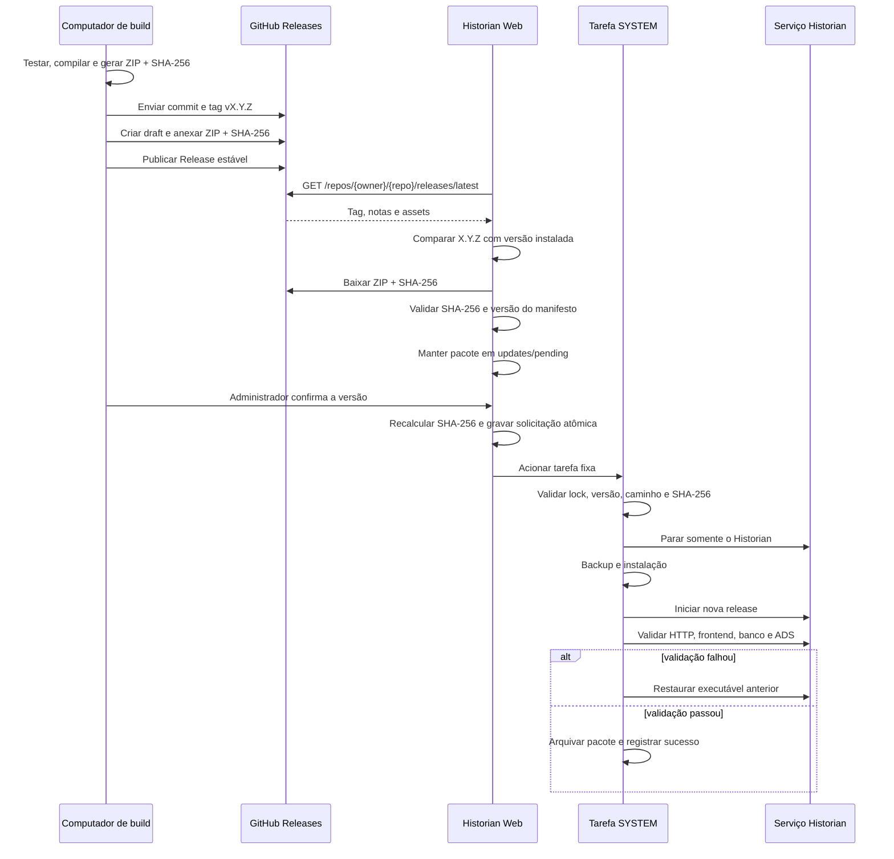

# Atualização segura por GitHub Releases

Este documento descreve o atualizador do **CPNTeck Paper Machine Historian**,
seu fluxo operacional, seus limites de segurança e o padrão recomendado para
replicá-lo em outras aplicações.

Para uma reprodução componente a componente por outro agente, use também
[AUTOMATIC-UPDATE-AGENT-HANDOFF.md](AUTOMATIC-UPDATE-AGENT-HANDOFF.md). Esse
handoff fixa a implementação `v0.1.6` como baseline e detalha contratos,
arquivos, sequência de execução, matriz de renomeação, testes e critérios de
aceite.

> Resumo executivo: o fluxo atual é adequado como base para uma rede industrial
> segregada e protege bem contra corrupção de arquivos, downloads incompletos,
> downgrade acidental e acionamento por usuários sem privilégio. Ele não é uma
> proteção absoluta contra invasões. Uma conta publicadora, o repositório, o
> computador de build ou um Administrador/SYSTEM do Windows comprometido ainda
> pode introduzir código malicioso. Antes de replicar em produção, aplique os
> endurecimentos da seção 8.

## 1. Objetivo e princípios

O servidor de produção não executa `git pull` e não compila código. Ele recebe
somente um pacote autocontido publicado como asset de uma GitHub Release
estável.

Princípios do desenho:

- separar download da instalação;
- usar token de produção somente para leitura;
- permitir instalação somente a Administradores da aplicação;
- aceitar apenas versões semanticamente mais novas;
- validar o pacote antes e imediatamente antes da instalação;
- executar a troca de versão em tarefa externa ao processo web;
- preservar banco, configuração, usuários e chaves;
- manter rollback e evidências em log;
- nunca reiniciar TwinCAT ou PLC.

## 2. Componentes e fronteiras de confiança

| Componente | Responsabilidade | Privilégio atual |
| --- | --- | --- |
| GitHub privado | Armazena tag, Release, ZIP e SHA-256 | Publicadores autorizados |
| `GitHubReleaseClient` | Consulta `/releases/latest` e baixa os assets por HTTPS | Serviço Historian |
| `ApplicationUpdateService` | Compara versões, valida, prepara e solicita instalação | Serviço Historian |
| API `/api/updates/*` | Expõe status e ações somente ao perfil `Administrator` | Sessão web autenticada |
| `updates\pending` | Guarda o pacote já baixado e validado | `SYSTEM` e Administradores |
| Tarefa agendada | Executa o atualizador fora do processo web | `SYSTEM`, nível mais alto |
| Instalador | Cria backup, troca a release, inicia e valida o serviço | `SYSTEM` |
| `deployment-state.json` | Registra versão atual/anterior e commit do pacote | `SYSTEM` e Administradores |

Pastas padrão:

```text
C:\Program Files\CPNTeck\PaperMachineHistorian\releases
C:\ProgramData\CPNTeck\PaperMachineHistorian
C:\ProgramData\CPNTeck\PaperMachineHistorian\updates
```

O instalador remove a herança de ACL do `DataRoot` e concede acesso integral
somente a `SYSTEM` e Administradores locais.

## 3. Fluxo ponta a ponta



### 3.1 Descoberta

O servidor consulta:

```text
GET https://api.github.com/repos/<owner>/<repository>/releases/latest
```

Drafts, pre-releases e tags sem Release publicada não fazem parte do canal
estável. A tag aceita é normalizada de `vX.Y.Z` para `X.Y.Z`.

### 3.2 Seleção dos assets

Para a versão `X.Y.Z`, os nomes precisam ser exatamente:

```text
CPNTeck-PaperMachineHistorian-X.Y.Z-win-x64.zip
CPNTeck-PaperMachineHistorian-X.Y.Z-win-x64.zip.sha256
```

O ZIP automático **Source code** do GitHub não é um pacote instalável.

### 3.3 Validações antes da instalação

O fluxo atual executa estas verificações:

1. Release mais nova que `deployment-state.json`;
2. nome exato dos assets;
3. formato de SHA-256 com 64 caracteres hexadecimais;
4. SHA-256 do ZIP baixado;
5. versão do `deployment-manifest.json` igual à tag;
6. SHA-256 novamente no momento da confirmação;
7. caminho do pacote restrito a `updates\pending`;
8. versão no formato `X.Y.Z`;
9. lock exclusivo para impedir duas instalações simultâneas;
10. hashes internos de todos os arquivos listados no manifesto;
11. health check, frontend, banco e ADS após iniciar a nova release.

Status e solicitação são gravados por arquivo temporário seguido de troca
atômica. O endpoint web não recebe comando, script ou caminho arbitrário.

## 4. Publicação de uma versão

### 4.1 Pré-condições

- alterações revisadas e commitadas;
- testes aprovados;
- branch enviada ao GitHub;
- árvore da aplicação limpa;
- versão ainda não publicada;
- conta publicadora protegida por MFA/passkey;
- pacote gerado do commit que será tagueado.

Verificação:

```powershell
git status --short -- Web/PaperMachine.Historian
git rev-parse HEAD
```

O primeiro comando não deve retornar arquivos da aplicação.

### 4.2 Gerar o pacote

Na pasta `Web\PaperMachine.Historian`:

```powershell
.\scripts\Publish-PaperMachineHistorian.ps1 -Version X.Y.Z
```

Para uma publicação oficial, não use `-SkipTests`.

O empacotador otimizado restaura as dependências uma vez, compila o frontend
uma vez, executa os testes em uma saída que não bloqueia o servidor local e usa
compactação rápida. Consulte [RELEASE-PROCESS.md](RELEASE-PROCESS.md) para os
parâmetros, cache, tempos por etapa e procedimentos de retomada.

Confira no manifesto interno:

```text
Version: X.Y.Z
GitCommit: <commit da tag>
GitDirty: false
```

### 4.3 Criar e enviar a tag

O fluxo recomendado automatiza as seções 4.2 até 4.5:

```powershell
.\scripts\Release-PaperMachineHistorian.ps1 -Version X.Y.Z
```

Sem `-Version`, o script consulta a última Release estável e incrementa
automaticamente o patch. Ele exige a pasta da aplicação limpa, gera e valida o
pacote, envia branch e tag juntos, cria a Release como draft e somente depois
publica e verifica stable/latest.

Os comandos manuais abaixo permanecem documentados como contingência:

```powershell
git tag -a vX.Y.Z -m "CPNTeck Paper Machine Historian X.Y.Z"
git push origin vX.Y.Z
```

Não mova nem reutilize tags de versão.

### 4.4 Criar a Release com GitHub CLI

Use draft para anexar tudo antes da publicação:

```powershell
$repository = 'FabioTCampion/ADF_MP1_TC4024_67'
$version = 'X.Y.Z'
$package = ".\artifacts\CPNTeck-PaperMachineHistorian-$version-win-x64.zip"
$checksum = "$package.sha256"

gh release create "v$version" `
  --repo $repository `
  --verify-tag `
  --draft `
  --title "CPNTeck Paper Machine Historian $version" `
  --notes "Notas da versão $version." `
  $package $checksum

gh release edit "v$version" `
  --repo $repository `
  --draft=false `
  --latest
```

Não marque a versão como pre-release.

### 4.5 Verificar a publicação

```powershell
gh release view "v$version" `
  --repo $repository `
  --json tagName,isDraft,isPrerelease,url,assets

gh api "repos/$repository/releases/latest" `
  --jq '{tag_name:.tag_name,draft:.draft,prerelease:.prerelease,assets:[.assets[].name]}'
```

O endpoint deve retornar a tag publicada, `draft: false`,
`prerelease: false` e os dois assets esperados.

## 5. Preparação do servidor

### 5.1 Token de leitura

Crie um fine-grained personal access token:

- resource owner correto;
- somente o repositório necessário;
- `Repository permissions > Contents > Read-only`;
- validade definida e renovação registrada;
- nenhuma permissão de escrita, administração ou workflow.

Configure-o por prompt mascarado:

```powershell
.\Set-PaperMachineHistorianUpdateToken.ps1
```

O token fica em:

```text
C:\ProgramData\CPNTeck\PaperMachineHistorian\updates\github-token.txt
```

Ele não deve aparecer em `appsettings`, Git, documentação, logs, linha de
comando ou chamado técnico.

### 5.2 Bootstrap

A primeira passagem de uma versão sem atualizador para uma versão que o contém
é manual:

```powershell
.\Update-PaperMachineHistorianService.ps1
```

Esse passo instala a tarefa agendada fixa. As próximas versões podem ser
operadas pela página **Atualizações**.

### 5.3 Operação normal

1. publicar uma Release estável;
2. aguardar a consulta automática ou clicar **Verificar atualizações**;
3. confirmar versão e notas;
4. aguardar download e estado `ready`;
5. digitar a versão para confirmar;
6. iniciar a instalação;
7. confirmar serviço, health, banco e ADS;
8. registrar a mudança na manutenção da máquina.

## 6. Estados e diagnóstico

Estados principais:

| Estado | Significado |
| --- | --- |
| `disabled` | Atualizador desabilitado |
| `checking` | Consultando GitHub |
| `upToDate` | Nenhuma versão mais nova |
| `available` | Release nova encontrada |
| `downloading` | Download em andamento |
| `ready` | Pacote baixado e validado |
| `installRequested` | Solicitação gravada e tarefa acionada |
| `installing` | Tarefa `SYSTEM` instalando |
| `succeeded` | Atualização concluída |
| `failed` | Falha registrada; verificar log e rollback |

Comandos:

```powershell
Get-Service CPNTeckPaperMachineHistorian
Get-ScheduledTask CPNTeckPaperMachineHistorianUpdater
Get-ScheduledTaskInfo CPNTeckPaperMachineHistorianUpdater

Get-Content `
  C:\ProgramData\CPNTeck\PaperMachineHistorian\updates\update-status.json

Get-ChildItem `
  C:\ProgramData\CPNTeck\PaperMachineHistorian\updates\logs |
  Sort-Object LastWriteTime -Descending |
  Select-Object -First 5
```

Erros frequentes:

| Erro | Causa provável |
| --- | --- |
| GitHub `404` | Release não publicada/estável, token sem acesso ou repositório incorreto |
| GitHub `401` | Token inválido, revogado ou expirado |
| GitHub `403` | Permissão insuficiente ou política da organização |
| Asset ausente | Nome do ZIP ou `.sha256` diferente do padrão |
| SHA-256 inválido | Upload incompleto, arquivo trocado ou checksum incorreto |
| Manifesto divergente | Tag, nome e versão interna não correspondem |
| Tarefa não inicia | Bootstrap incompleto ou tarefa removida |
| Health falhou | Nova aplicação não iniciou; verificar log e rollback |

### Falha ao criar ou atualizar um serviço Windows

Os caminhos executáveis dos serviços podem conter espaços e argumentos com
aspas. Eles não devem ser enviados como um argumento complexo para `sc.exe` no
Windows PowerShell 5.1, pois a linha pode ser dividida incorretamente. O fluxo
atual cria serviços com `New-Service` e altera caminhos existentes com
`Win32_Service.Change`. O `sc.exe` permanece restrito a opções simples, como
dependências, descrição e ações de recuperação.

Se uma instalação falhar:

1. a release incompleta é removida somente depois da restauração da versão
   anterior;
2. a solicitação que falhou é movida para `updates\failed`, evitando repetição
   acidental;
3. `lastInstallError` permanece no estado e na página de atualizações, mesmo
   que uma verificação posterior do GitHub seja bem-sucedida;
4. a correção deve ser publicada com uma nova versão. Não reutilize a tag ou o
   pacote que falhou e não use `-Force` como procedimento normal.

## 7. Avaliação de segurança

### 7.1 Proteções existentes

| Ameaça | Controle atual |
| --- | --- |
| Usuário web comum solicita instalação | Endpoints exigem perfil `Administrator` |
| Tentativas repetidas | Rate limiting nos endpoints de autenticação e atualização |
| CSRF comum entre sites | Cookie `HttpOnly` e `SameSite=Strict` |
| Download interceptado/corrompido | HTTPS e verificação SHA-256 |
| Pacote alterado após download | SHA-256 recalculado antes da solicitação e pela tarefa |
| Caminho ou comando arbitrário pela API | API aceita somente versão; caminhos vêm do estado interno |
| Pacote fora da área controlada | Validação de prefixo canônico de `updates\pending` |
| Instalações concorrentes | Lock exclusivo e tarefa com `IgnoreNew` |
| Acesso local por usuário padrão | ACL restrita a `SYSTEM` e Administradores |
| Token roubado do servidor | Token é somente leitura e limitado a um repositório |
| Falha funcional da nova versão | Backup, readiness checks e rollback do executável |
| Downgrade automático | Somente versão semanticamente mais nova é preparada |

### 7.2 Riscos residuais

1. **ZIP e SHA-256 têm a mesma origem.** O checksum garante integridade, mas
   não fornece autenticidade independente. Quem controlar a publicação da
   Release pode trocar pacote e checksum.
2. **Comprometimento do GitHub ou do publicador é crítico.** Uma Release
   maliciosa será executada como `SYSTEM`.
3. **Build feito em estação de desenvolvimento.** Malware ou dependência
   comprometida nessa estação pode contaminar o pacote antes da publicação.
4. **Interface em HTTP.** Em uma rede não confiável, credenciais e cookie de
   sessão podem ser interceptados. `SameSite=Strict` não substitui TLS.
5. **Serviço web com privilégio elevado.** Uma vulnerabilidade de execução
   remota no Historian teria impacto sobre o Windows inteiro.
6. **Administrador/SYSTEM local permanece soberano.** ACL não protege contra
   uma conta que já possui esses privilégios.
7. **Sem limite explícito de pacote/espaço livre.** Uma publicação maliciosa ou
   incorreta pode consumir disco.
8. **Rollback de executável não desfaz automaticamente migrações destrutivas de
   banco.** Migrações devem continuar aditivas e compatíveis.
9. **A máquina também executa PLC.** O impacto de comprometer o Windows é maior,
   mesmo que o Historian não escreva no PLC.

Conclusão: o fluxo atual é **razoavelmente seguro contra corrupção, MITM comum e
acionamento não autorizado pela aplicação**, mas **não é suficiente sozinho
contra ataque de cadeia de suprimentos, conta GitHub comprometida, captura de
sessão em HTTP, Administrador local ou vulnerabilidade com execução remota**.

## 8. Endurecimento obrigatório para novas aplicações

### Prioridade 0 — antes de replicar

1. Habilitar **release immutability** em
   `Repository > Settings > General > Releases`. Ela vale apenas para Releases
   futuras. Publicar sempre como draft, anexar todos os assets e só então
   publicar.
2. Exigir MFA/passkey nas contas publicadoras e reduzir ao mínimo as pessoas
   com permissão de Release.
3. Proteger a branch de produção e tags de versão com ruleset: pull request,
   revisão, checks obrigatórios, bloqueio de force-push e exclusão.
4. Usar HTTPS para a interface administrativa. Se não houver certificado
   direto no Kestrel, usar reverse proxy local e restringir a porta 5088 a
   `127.0.0.1`.
5. Restringir o firewall à VLAN/sub-rede de manutenção exata; não publicar a
   porta na Internet.
6. Executar o serviço web com conta dedicada e mínimo privilégio. Manter apenas
   a tarefa instaladora como `SYSTEM`, com permissão de execução controlada.
7. Adicionar assinatura independente do pacote ou manifesto, por exemplo
   Ed25519/Authenticode, e embutir somente a chave pública no servidor.
   Verificar a assinatura antes de extrair ou executar PowerShell.

### Prioridade 1 — cadeia de fornecimento

1. Gerar o pacote em GitHub Actions ou runner controlado, partindo da tag.
2. Fixar Actions de terceiros por commit e revisar atualizações de dependência.
3. Gerar e verificar GitHub Artifact Attestations para vincular pacote,
   workflow, repositório e commit.
4. Produzir SBOM e manter análise de vulnerabilidades.
5. Impor tamanho máximo do ZIP, quantidade máxima de entradas, tamanho
   descompactado e espaço livre mínimo.
6. Validar layout único do ZIP e impedir entradas absolutas ou com `..` antes
   da extração.
7. Aceitar somente um manifesto assinado e rejeitar arquivos extras não
   declarados.

### Prioridade 2 — operação e resposta

- registrar quem publicou, aprovou e instalou cada versão;
- alertar falhas, expiração do token e atualização pendente;
- rotacionar o token antes da expiração e revogá-lo em incidentes;
- monitorar alterações na tarefa agendada, serviço e ACL;
- manter Windows, GitHub CLI de build e dependências corrigidos;
- testar rollback e restauração do banco periodicamente;
- definir janela de manutenção e plano de parada segura.

Referências oficiais:

- [Immutable releases](https://docs.github.com/en/code-security/concepts/supply-chain-security/immutable-releases)
- [Habilitar imutabilidade de Releases](https://docs.github.com/en/code-security/how-tos/secure-your-supply-chain/establish-provenance-and-integrity/prevent-release-changes)
- [Artifact attestations](https://docs.github.com/en/actions/concepts/security/artifact-attestations)
- [Verificar integridade de uma Release](https://docs.github.com/en/code-security/how-tos/secure-your-supply-chain/secure-your-dependencies/verify-release-integrity)
- [Protected branches](https://docs.github.com/en/repositories/configuring-branches-and-merges-in-your-repository/managing-protected-branches/about-protected-branches)
- [Gerenciar fine-grained tokens](https://docs.github.com/en/authentication/keeping-your-account-and-data-secure/managing-your-personal-access-tokens)

## 9. Checklist para replicar em outra aplicação

Substitua e documente:

| Item | Exemplo atual |
| --- | --- |
| Nome exibido | CPNTeck Paper Machine Historian |
| Prefixo do pacote | `CPNTeck-PaperMachineHistorian` |
| Repositório | `FabioTCampion/ADF_MP1_TC4024_67` |
| Runtime | `win-x64` |
| Serviço | `CPNTeckPaperMachineHistorian` |
| Tarefa | `CPNTeckPaperMachineHistorianUpdater` |
| `InstallRoot` | `C:\Program Files\CPNTeck\PaperMachineHistorian` |
| `DataRoot` | `C:\ProgramData\CPNTeck\PaperMachineHistorian` |
| Porta | `5088` |
| Health | `/health` e `/health/ready` |
| Papel autorizado | `Administrator` |
| Variável de token | `PAPER_MACHINE_HISTORIAN_GITHUB_TOKEN` |

Checklist de implementação:

- [ ] configuração `Updates` com owner, repo, prefixo, runtime e intervalo;
- [ ] cliente GitHub com token somente leitura;
- [ ] comparação semântica e recusa de downgrade;
- [ ] asset com nome exato;
- [ ] download parcial seguido de troca atômica;
- [ ] SHA-256 e assinatura independente;
- [ ] validação de manifesto, layout, tamanho e caminhos;
- [ ] diretório protegido por ACL;
- [ ] endpoints somente para Administrador;
- [ ] confirmação explícita da versão;
- [ ] tarefa externa fixa e não parametrizável pela requisição web;
- [ ] lock contra concorrência;
- [ ] backup consistente;
- [ ] migrações aditivas;
- [ ] health/readiness específicos da aplicação;
- [ ] rollback testado;
- [ ] logs e auditoria;
- [ ] HTTPS e firewall restrito;
- [ ] CI, attestation e Release imutável;
- [ ] procedimento de rotação/revogação de token.

## 10. Critério de aprovação

Uma nova aplicação só deve habilitar instalação web em produção quando:

1. todos os itens de Prioridade 0 estiverem atendidos ou formalmente aceitos;
2. o pacote for reproduzível/rastreável até um commit revisado;
3. a identidade publicadora e a chave de assinatura estiverem sob controle;
4. rollback tiver sido executado em ambiente de teste;
5. o servidor estiver em rede segregada, com HTTPS e backup válido;
6. estiver claro quem pode publicar, aprovar, instalar e responder a incidentes.
